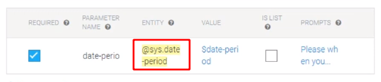

### Steps to create minimal chatbot
1. Create Agent - The actual bot
2. To test, go to integrations -> check web integration.
3. To improve, create intents (collection of conversation on a specific topic)
   1. Add training phrases.
   2. Add responses.
        >These two are needed for minimal conversation.
   3. Add Entity (variables extracted during conversation)
      1. Predefined. Eg.
          
       2. Custom. Eg.
          
        
    >First add entity, then training expressions to avoid some errors.

    >We can make an entity required and add prompt if user doesn't provides it.

#### Small Talk
- [ ] Small Talk section in dialogflow lists out common questions asked to a chatbot (pre-populated by google). You can add the response you wish to add.