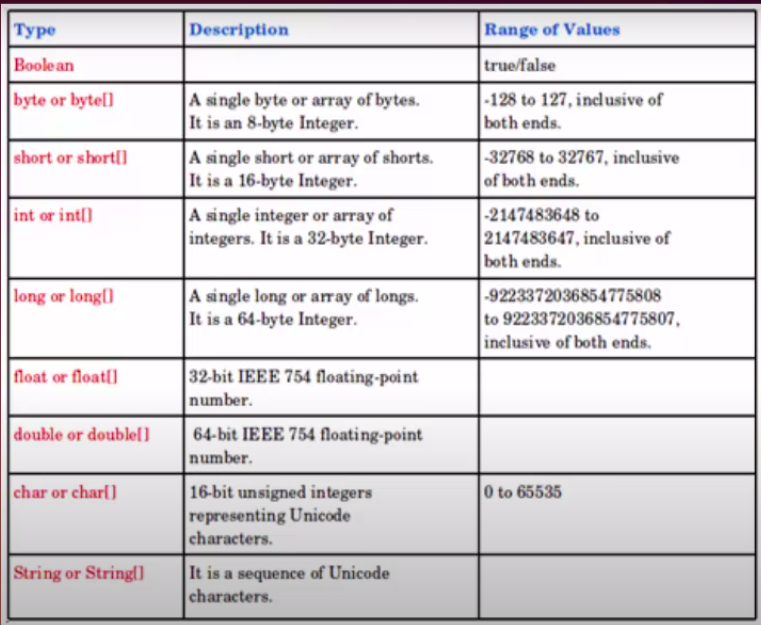
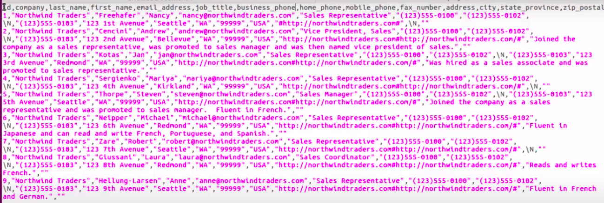

## Commands
- [ ] create : To create nodes.
- [ ] match : To find nodes.
- [ ] return : To display nodes.
- [ ] return distinct: To display unique nodes.
- [ ] where : To apply conditions.
- [ ] delete : To delete nodes.
- [ ] limit : To limit the number of nodes returned.
- [ ] id(n) : To get id of a node n.
- [ ] in : To check if a value in a list of values. ([1, 3, 4])
- [ ] or : Well, its OR.
- [ ] set : To update labels and properties in nodes.
- [ ] remove : To delete particular label or property from a node.
- [ ] labels(n) : To get labels-set of nodes n.
- [ ] toInt(n.value) : To typecast a property to integer.
- [ ] += : To update existing properties (used in set clause).
- [ ] exists : To see if a property exists.

## Examples
### Create Nodes
- [x] create ()
- [x] create (), ()
- [x] create (:Student)
- [x] create (:Student:Person)
- [x] create ({name:"Manas"})
- [x] create ({\`first name`:"Manas"})
- [x] create ({name:"Lakshya",hobby:"Dance"})
- [x] create (:Student{name:"Manas"})
- [x] create (divya:Student{name:"Divya"})
>Labels and properties are case sensitive.

### Match
>Match must end with a return, set or delete clause.
> just append a return statement at the end of each statement.
- [x] match (n)
- [x] match (n:Student)
- [x] match (n{name:"Manas"})
- [x] match (n:Student:Person)
- [x] match (n:Student{name:"Manas"})
- [x] match (ma{name:"Manas"}), (di{name:"Divya"}) return ma, di

### Create Relationships
>First create variables a, b by using match commands.
>Exactly one label can be applied to a relationship (called 'type').
>We cannot create bi-directional relationships using 'create'
- [x] create (a)-[:LIKES]->(b)
- [x] create (a)<-[:HELPS]-(b)
- [x] create (a)-[:FRIEND{since:"college", nickname:"callback"}]->(b)

#### Matching Relationships
- [x] match (a)-[r]->(b)
- [x] match (a)-[r:FRIEND]-(b)

### Where
>Prepend 'match (n)' and append 'return n'.
- [x] where n:Person
- [x] where n.name="Manas"
- [x] where n:Person:Student
- [x] where n:Person or n:Student
- [x] where n.price < 1000
- [x] where n.name in ["Manas", "Lakshya"]
- [x] where n:Student and n.name="Manas"

### Set
>Prepend a match-clause (for n) and append return-clause.
- [x] set n:Human
- [x] set n.age=25
- [x] set n:Animal:Atoms
- [x] set n.age=25,n.name="Someone"
- [x] set n +={age:26}
- [x] set n1=n2 count

### Remove
>Prepend match-clause
- [x] remove n:Student
- [x] remove n:Student:Person

### Misc
- [x] match (n) return distinct labels(n)
- [x] match (n) return count(distinct labels(n))
- [x] match (n) return distinct labels(n),count(labels(n))

## Property DataTypes
1. boolean
2. int
3. double
4. long
5. char
6. string
7. Array of primitives
>NULL is not a valid value of any property.

  

### Examples
- [x] create ({title:"A string", names:["An", "array", "of", "strings"], price:10.5, pages:321, available:false})
- [x] create ({an_array:["A string", 22]})
>Array must be homogeneous.

## Some things that may be needed in future
### Importing CSV Data
#### Method 1
1. To enable neo4j to access filesystem to import csv files, in /etc/neo4j/neo4j.conf
   - dbms.security.allow_csv_import_from_file_urls=true
   - #dbms.directories.import=import
   - Then restart neo4j service.

  

1. load csv with headers from "file:///home/path/to/csv/file.csv" as row create (:Employee{employeeID:toInt(row.id), firstName:row.first_name, lastName:row.last_name, title:row.job_title});

#### Method 2 (more secure)
1. To enable neo4j to access filesystem to import csv files, in /etc/neo4j/neo4j.conf
   - #dbms.security.allow_csv_import_from_file_urls=true
   - dbms.directories.import=/var/lib/neo4j/import
   - Then restart the neo4j service.
>You can modify the path to your preferred directory also.
2. Place your csv file into /var/lib/neo4j/import directory.
3. Execute same command as above method (just write the filename.csv of the file inside import directory).

# Neo4j Specific
- [ ] To switch databases
  - [ ] :use [database-name]