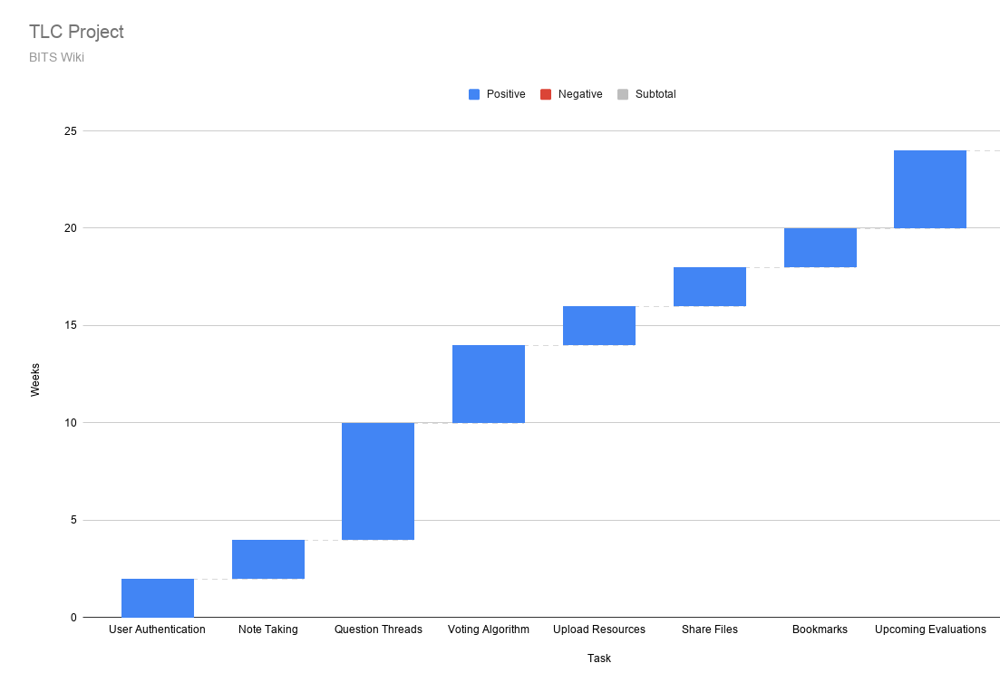

# TLC Project
## Title - **BITS Wiki**
## Name of Investigator -
 **Manas Mishra** 
    a. Designation - ***Student*** 
    b. Department / Division - ***Computer Science + Physics***  
    c. Campus - ***Pilani***
## Name of co-investigators
   1. **Divya Tyagi**
   2. **Lakshya Agarwal**
   3. **Adya Pathak**
   4. **Hritik Madankar**
## Project Summary:
A web-based Community Forum for BITSian students and professors. Every Student and Professor would have a unique profile. They can post, edit, update their relevant academic questions to be answered by the community. The discussions will be available for reference to other students as well. Students may create, save and share academic notes online. Further, the relevant questions on the forum could be saved as a ‘bookmark’ for future reference.

## Project Outcome
Every year, students face similar academic doubts. With students and professor asking and answering questions, a relevant FAQ would be created for the next batch of students. This will save a lot of time for students who earlier had to ask their seniors and individually mail professors for answering their queries. Further, it will provide deeper academic clarity to the students and hence help in improving learning outcomes. Students of all batches and teachers can also stay connected and share relevant findings in research and technology.

This will enhance mutual learning among students and professors. Also this will reduce communication gap between them as Professors could know the level of understanding by the doubts raised by the students. Also, students may get all the resources organized at one place.

## Key words :
* Discussion Forum
* Note Taking
* Web Application

## Objectives of the proposed research :
* To understand the problems faced by students and teachers.
* Ways to overcome them.
## Research Methodology
* Google questionnaire for conducting survey.

## Time schedule of activities

  

## Expertise of investigators:
### Manas Mishra
1. **Django**: Python Web server framework for dynamic websites.
2. **Basic Web Development**: HTML,CSS, JavaScript and JQuery
3. **Basic Nginx and Gunicorn**: Server applications to serve websites in production.
4. **Basic Ansible**: Application to automate web hosting tasks.
5. **Bootstrap**: To design UI.

### Lakshya Agarwal
1. **Javascript**: Web Browser scripting language.
2. **React**: Web Front-End library.
3. **Basic Web Development Tools**: HTML,CSS, Bootstrap and JQuery.
4. **Jest**: Library for Test-Driven Development in React.
 
 
### Divya Tyagi
1. **Javascript**: Web Browser scripting language.
2. **Python**: Programming language for Django Framework.
3. **Basic Web Development**: HTML,CSS and JQuery.
4. **Bootstrap**: UI Design CSS framework.

### Adya Pathak
1. **Javascript**: Web Browser scripting language.
2. **Basic Angular 2**- Front end web framework.
3. **Node JS** - Server side programming language.
4. **Basic Web Development**: HTML,CSS and JQuery.
5. **Bootstrap**: UI Design CSS framework.

### Hritik Madankar
1. **Javascript**: Web Browser scripting language.
2. **React**- Front end web library.
3. **Basic Web Development**: HTML,CSS and JQuery.
4. **Bootstrap**: UI Design CSS framework.

## Budget
1. Server for hosting
   ##### Digital Ocean Server Pricing
  

**AWS or college servers can also be used.

2. Domain for website
   ##### Godaddy Domain Pricing
   Godaddy domain price ≅ ₹600 /year
  
  
  
  
### Total Price:
  
**Total cost ≅ ₹18,500 per year** 
*Conversion rate: $1 = ₹ 73.91 (26 Nov, 2020 ) 
**Server Storage cost may imply as per usage